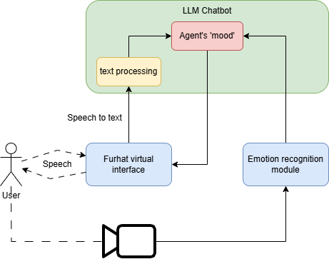
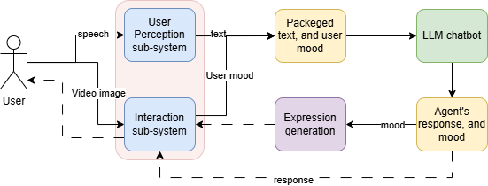

# Intelligent and Interactive Systems Project

## Overview
This repository contains the project for the Intelligent and Interactive Systems course. The project involves creating an interactive system using the Furhat robot, which can recognize user moods and respond accordingly.

## Files and Directories

### main.py
`main.py` is our merged solution that integrates all subsystems to create a cohesive interactive experience with the Furhat robot.

### mood_recognition.py
`mood_recognition.py` is our user perception subsystem. It is responsible for recognizing the mood of the user based on their input.

### interaction.py
`interaction.py` is our interaction subsystem. It handles the interaction logic between the user and the Furhat robot.

### gestures.py
`gestures.py` includes the possible gestures for our Furhat agent. It also defines the necessary functions to generate and execute these gestures.

### system_design
The `system_design` folder contains a diagram of the system design. This diagram provides a visual representation of how the different subsystems interact with each other.



### train_model
The `train_model` folder was used for training the different models for the user perception subsystem. It contains scripts used during the training process. For training data the DiffusionFER_S dataset was used.

In this folder `EmtionClassifier.ipynb` notebook inludes our most successfull trainings.

### Pipeline

The pipeline for our interactive system is designed to ensure smooth and efficient processing of user inputs and generation of appropriate responses. The following diagram illustrates the flow of data and control through the various subsystems:



1. **User Input**: The user interacts with the Furhat robot through speech or gestures.
2. **Mood Recognition**: The `mood_recognition.py` script processes the user input to determine the user's mood.
3. **Interaction Logic**: Based on the recognized mood, the `interaction.py` script decides the appropriate response.
4. **Gesture Generation**: The `gestures.py` script generates the necessary gestures for the Furhat robot to perform.
5. **Response Execution**: The Furhat robot executes the gestures and delivers the response to the user.

This pipeline ensures that the system can effectively recognize and respond to user moods in real-time.

## Getting Started
To get started with this project, follow these steps:

1. Clone the repository:
    ```bash
    git clone https://github.com/yourusername/your-repo.git
    ```
2. Install the required dependencies:
    ```bash
    pip install -r requirements.txt
    ```
3. Run the main script:
    ```bash
    python main.py
    ```

## Usage
The Furhat robot will start interacting with users, recognizing their moods, and responding with appropriate gestures and dialogue.

## Acknowledgements
We would like to thank our course instructors and peers for their support and guidance throughout this project.